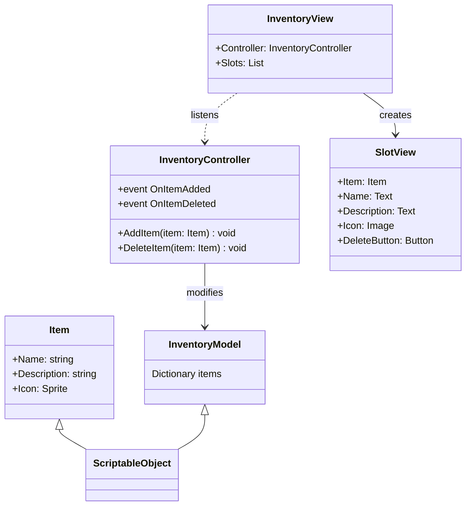

```mermaid
classDiagram

    %% Model

    class Item {
        +Name: string
        +Description: string
        +Icon: Sprite
    }
    Item <|-- ScriptableObject

    class InventoryModel {
        Dictionary<Item,integer> items
    }
    InventoryModel <|-- ScriptableObject

    %% Controller

    class InventoryController {
        +event OnItemAdded
        +event OnItemDeleted

        +AddItem(item: Item) void
        +DeleteItem(item: Item) void
    }
    InventoryController --> InventoryModel : modifies

    %% View

    class SlotView {
        +Item: Item
        +Name: Text
        +Description: Text
        +Icon: Image
        +DeleteButton: Button
    }

    class InventoryView {
        +Controller: InventoryController
        +Slots: List<SlotView>
    }

    InventoryView ..> InventoryController : listens
    InventoryView --> SlotView : creates
```